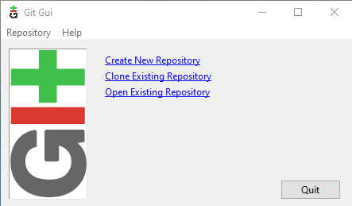
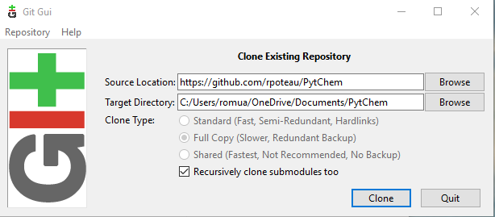
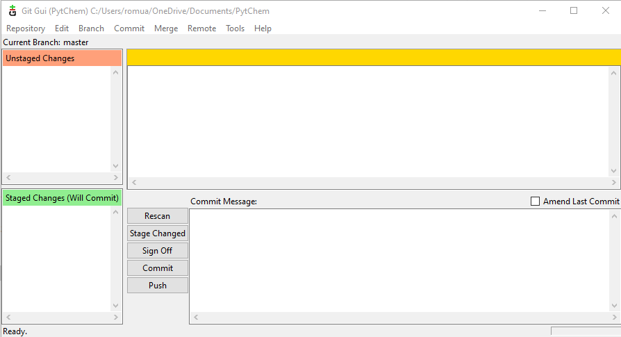
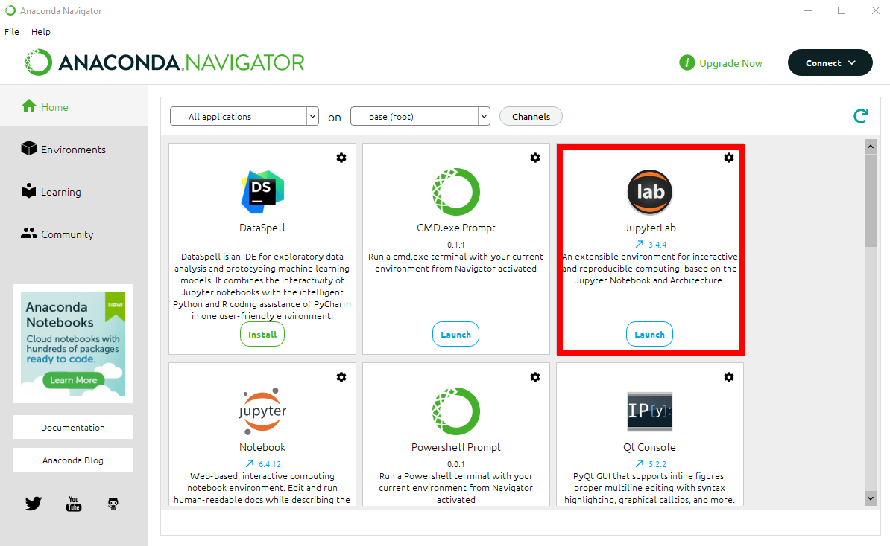

<a name="top">

</a>

Des exemples commentés et généralement illustrés sont disponibles sous
forme de Jupyter Notebooks

*Commented and generally illustrated examples are available in the form
of Jupyter Notebooks*

-   [Document principal et pré-requis / *Main document and prerequisites*](#main)
-   [Comment lire et utiliser ces notebooks ? / *How to read and use these notebooks?*](#howto)
    -   [**1.** Installer Jupyter ainsi qu'une distribution Python /
        *Install Jupyter as well as a Python
        distribution*](#howto1)
    -   [**2.** Cloner ou Télécharger le dépôt (repository) pyPhysChem /
        *Clone or Download the pyPhysChem repository*](#howto2)
        - [Linux](#cloneL)
        - [Windows](#cloneW)
    -   [**3.** Exécuter ces notebooks à l'aide de JupyterLab /
        Run these notebooks with JupyterLab](#howto3)
        - [Linux](#jupL)
        - [Windows](#jupW)
-   [Bibliothèques Python & extensions Jupyter nécessaires /
    *Required Python libraries and JupyterLab extensions*](#lib)
    - [Bibliothèques / *Libraries*](#bib)
    - [Extensions JupyterLab / *JupyterLab extensions*](#ext)
-   [Liste des changements /
    *List of changes*](#changes)
-   [Comment citer ce travail ? / *How to cite this work?*](#cite)
    
## <a name="main"></a> Document principal et pré-requis / *Main document and prerequisites*


Il faut lire le fichier [TOC.ipynb](./TOC.ipynb), qui renvoie vers des sous-thèmes. Chaque sous-thème est introduit par les objectifs de ces TP, ainsi qu'une table des matières qui permet d'accéder aux cours/TP et aux exercices.

**Pré-requis** : des notions très élémentaires d'algorithmique (variables, tests conditionnels, boucles).
<span style="color:red">&#x1F914; Vous voulez rafraîchir vos connaissances et renforcer vos acquis ?</span>
**Le notebook [PPCL.ipynb](./PPCL.ipynb) est fait pour ça. Il est un peu long, mais il en vaut la peine** &#x1F60A;.
 Vous pouvez peut-être même vous lancer sans aucune connaissance algorithmique de base. C'est à vous de voir si cela vous suffit.&#x1F4AA;&#x1F4AA;&#x1F3FC;&#x1F4AA;&#x1F3FF;

*Read the [TOC.ipynb](./TOC.ipynb) file, which points to subtopics. Each subtopic is introduced by the goals of the course, as
well as a table of contents that allows access to the courses/tutorials and exercises.*

***Prerequisite** : very basic notions of algorithmic (variables, conditional tests, loops).* 
<span style="color:red">&#x1F914; *Do you want to refresh your knowledge and reinforce your skills?*</span>
***This is what the [PPCL.ipynb](./PPCL.ipynb) notebook is for. It's a bit long, but it's worth the effort*** &#x1F60A;. *You may even be able to get started without any basic algorithmic knowledge. It's up to you to see if that's enough for you.*&#x1F4AA;&#x1F4AA;&#x1F3FC;&#x1F4AA;&#x1F3FF;


## <a name="howto"></a>Comment lire et utiliser ces notebooks ? / *How to read and use these notebooks?*

### <a name="howto1"></a>**1.** Installer Jupyter ainsi qu'une distribution Python / *Install Jupyter as well as a Python distribution*

Il faut d'abord avoir installé [Jupyter](https://jupyter.org/) ainsi
qu'une distribution python sur son PC.

La solution la plus simple est d'installer et utiliser
[Anaconda](https://www.anaconda.com/), qui est une distribution libre et
open source du langage de programmation Python :

-   Les versions de paquetages sont gérées par le système de gestion de
    paquets conda
-   Elle comprend également Anaconda Navigator, qui est une interface
    graphique "user-friendly"
-   Les applications suivantes sont disponibles par défaut dans le
    navigateur :
    -   JupyterLab & Jupyter Notebook
    -   Spyder
    -   RStudio
    -   ...
-   Anaconda est disponible pour MacOS, Windows, Linux.

*First install [Jupyter](https://jupyter.org/) as well as a Python
distribution on your PC.*

*A simple and easy possibility is to install
[Anaconda](https://www.anaconda.com/), a free and opensource
distribution of the Python programming language:*

-   *Package versions are managed by the package management system
    conda*
-   *It also includes a user friendly GUI, Anaconda Navigator*
-   *The following applications are available by default in Navigator:*
    -   *JupyterLab & Jupyter Notebook*
    -   *Spyder*
    -   *RStudio*
    -   ...
-   *Anaconda runs under MacOS, Windows, Linux.*

[&#x1F51D; top &#x1F51D;](#top)

### <a name="howto2"></a>**2.** Cloner ou Télécharger le dépôt (repository) pyPhysChem / *Clone or Download the pyPhysChem repository*

#### Télécharger / *Download*

**Ce n'est pas la façon de faire qui est recommandée**, bien que ce soit
la plus simple. Essayez plutôt le clonage (voir paragraphe "cloner le
dépôt" ci-dessous 👇) / ***It is not the recommended way**, although it
is the simplest. Try clone the repository instead (see the "clone
repository" subsection below* 👇)

Téléchargez l'archive zip / Download the zip archive


#### Cloner le dépôt / *Clone the repository*

**C'est la méthode recommandée**, car elle facilite la mise à jour des
notebooks / ***This is the recommended way**, given the ease of updating
notebooks*

##### <a name="cloneL">Sous Linux / *Under Linux*

Ouvrez un terminal. Depuis le répertoire où vous voulez installer les
notebooks, tapez la commande : / *Open a terminal. Go into the folder in
which the notebooks will be installed, and type:*

```bash
git clone https://github.com/rpoteau/pyPhysChem.git
```

Vous avez maintenant un répertoire `pyPhysChem` dans le répertoire depuis
lequel vous avez lancé la commande `git` / *You now have a `pyPhysChem`
folder installed in the folder from which the `git` command was ran*

pyPhysChem étant un projet en évolution, il faut régulièrement vérifier
qu'il n'y a pas de mise à jour. La commande suivante met si nécessaire à
jour le contenu du répertoire `Pytchem` / *Pytchem being a
work-in-progress project, it is necessary to regularly check for a
possible update. The content of the `pyPhysChem` folder is updated by using
the following command*:

allez d'abord dans le répertoire pyPhysChem / *first go into the `pyPhysChem`
folder*

puis tapez / *and then enter*

```bash
git pull origin main
```

##### <a name="cloneW">Sous Windows / Under Windows

Vous devez télécharger et installer [l'application
git](https://gitforwindows.org/). Ne changez aucune option par défaut, à
l'exception de l'éditeur Nano au lieu de vi / *You must download and
install [the git application](https://gitforwindows.org/). Do not change
any default options, except for the Nano editor instead of vi*

Exécutez ensuite l'application Git GUI. Ça devrait ressembler à ça : /
*Then run the Git GUI application. It should look like:*



Cliquez sur "Clone existing repository". Collez l'adresse
https://github.com/rpoteau/pyPhysChem.git dans le champ "Source location".
Choisissez un emplacement où cloner pyPhysChem dans "Target Directory",
ajoutez pyPhysChem au chemin. Ce répertoire va être créé par Git GUI /
*Click on "Clone existing repository". Paste the
https://github.com/rpoteau/pyPhysChem.git in the "Source location" field.
Choose the local target folder. Add pyPhysChem to the pathway. This folder
will be created by Git GUI*



Cliquez sur "Clone". Patientez. À la fin de l'installation, vous allez
voir cette fenêtre : / *Click on "Clone". Wait. This window will appear
after the installation is completed:*



Vous pouvez fermer cette application / *You can close this application*

[&#x1F51D; top &#x1F51D;](#top)

### <a name="howto3"></a>**3.** Exécuter ces notebooks à l'aide de JupyterLab / Run these notebooks with JupyterLab

#### <a name="jupL">Sous Linux / *Under Linux*

-   Ouvrez un terminal / *Open a terminal*
-   Allez (commande `cd chemin d'accès`) dans le répertoire qui contient
    pyPhysChem / *Navigate to the folder that contains pyPhysChem
    (`cd pathway`)*
-   tapez la commande / *enter the command*

```bash
jupyter-lab TOC.ipynb
```

#### <a name="jupW">Sous Windows / *Under Windows*

Le plus simple est de passer par Anaconda Navigator, puis de
sélectionner JupyterLab / *The easiest way is to select JupyterLab from
Anaconda Navigator*



Il ne reste plus qu'à naviguer jusqu'au répertoire qui contient pyPhysChem,
et à charger la table des matières intitulée `TOC.ipynb` / *All that
remains is to navigate to the directory that contains pyPhysChem, and load
the table of contents entitled `TOC.ipynb`.*


[&#x1F51D; top &#x1F51D;](#top)

## <a name="lib"></a>Bibliothèques Python & extensions Jupyter nécessaires / *Required Python libraries and JupyterLab extensions*

### <a name="bib"></a>Bibliothèques / *Libraries*
    
Vous devez installer les bibliothèques suivantes dans votre environnement Python / *You must install the following libraries in your Python environment*:

-   ```matplotlib``` ✅
-   ```numpy``` ✅
-   ```scipy``` ✅
-   ```sympy``` ✅
-   ```pandas``` ✅
-   ```dataframe-image``` ❌
-   ```seaborn``` ✅
-   ```scikit learn``` ✅
-   ```tensorflow``` ❌
-   ```keras``` ❌
-   ```plotly``` ✅
-   ```jupyter_jsmol``` ❌
-   ```rdkit``` ❌
<br><br>
- ✅ = bibliothèque installée par défaut avec Anaconda / *library installed by default in Anaconda*
- ❌ = bibliothèque à installer dans l'environnement de base de Anaconda / *library to be installed in the base environment of Anaconda*:
    -   dans Anaconda navigator, cliquez sur "Environments", puis sur "Base"
    / *select "Environments" and "Base" in Anaconda Navigator*
    -   puis sélectionnez "not installed", et enfin entrez dans le champ
    "search package" le nom de la bibliothèque que vous voulez installer
    (exemple ```keras```) / *then select "not installed", and finally enter in
    the "search package" field the name of the library you want to
    install (e.g. ```keras```)*


    
### <a name="ext"></a>Extensions JupyterLab / *JupyterLab extensions*
    
Certaines extensions JupyterLab sont recommandées, voire nécessaires / *Some JupyterLab extensions are recommended or even necessary*:

- ```@jupyterlab/plotly```
- ```@jupyterlab/latex```

Les installer via l'onglet "extension manager" de JupterLab ; vous pouvez faire les chercher dans la liste ou bien utiliser le champ "search" / *Install them using the JupyterLab "extension manager" tab; you can search them in the list or use the "search" field*


## <a name="changes"></a>Liste des changements / *List of changes*

[🔄 Liste des changements / *List of changes* 🔄](./CHANGE.md)

## <a name="cite"></a> Comment citer ce travail ? / *How to cite this work?*
 
Si vous utilisez des parties significatives des codes publiés dans ce dépôt github, ou bien s'il a été utile pour votre auto-formation, veuillez le citer comme suit :<br>
*If you use pieces of code of this github repository that turned out to be decisive to your work, or that have been useful for your self-learning, please cite it as follows*:

 S. Christodoulou, Iann C. Gerber, F. Jolibois and R. Poteau, *Python in the Physical Chemistry lab (pyPhysChem) github repository*, release v. 1.7.4 (2023), doi: [10.5281/zenodo.8396813](https://doi.org/10.5281/zenodo.8396813)
    
[](https://doi.org/10.5281/zenodo.8396813)

[&#x1F51D; top &#x1F51D;](#top)
