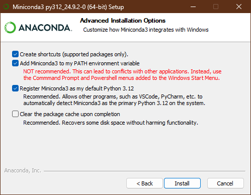
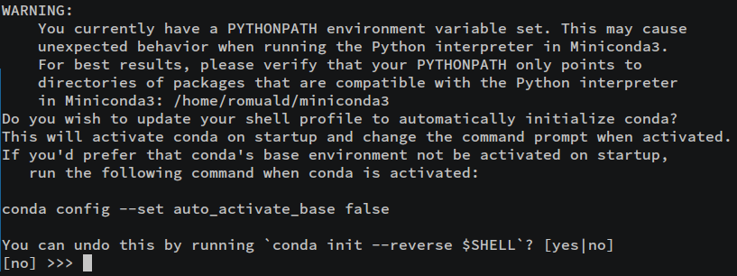
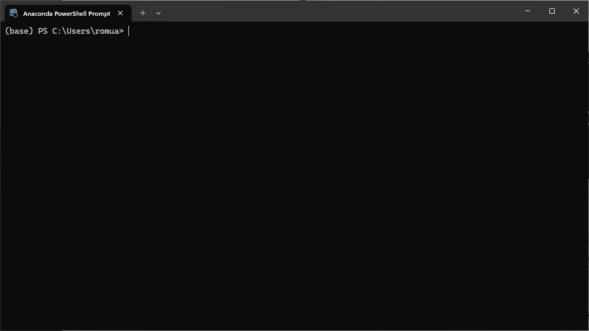
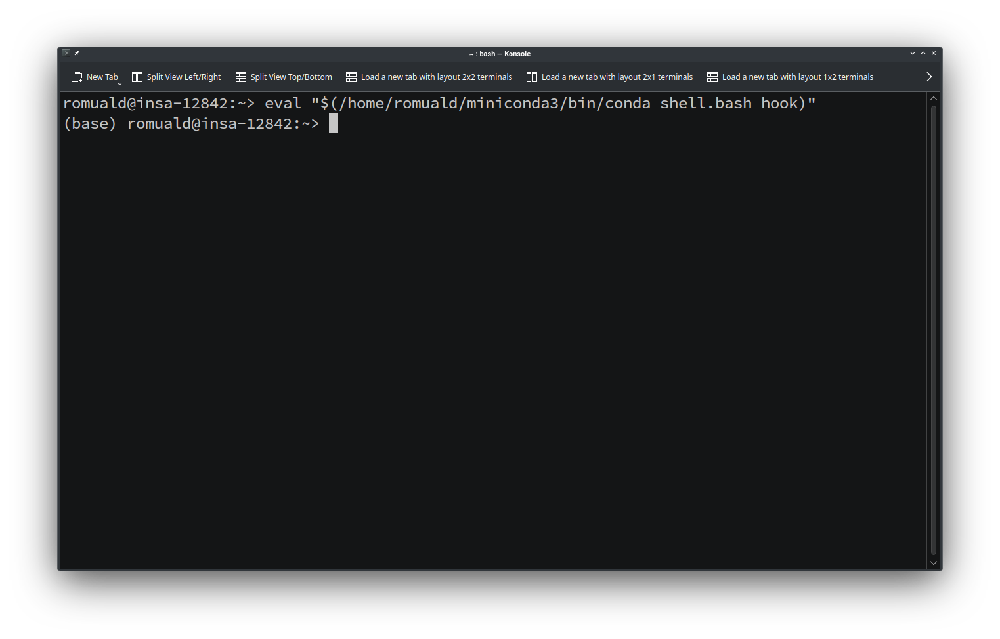
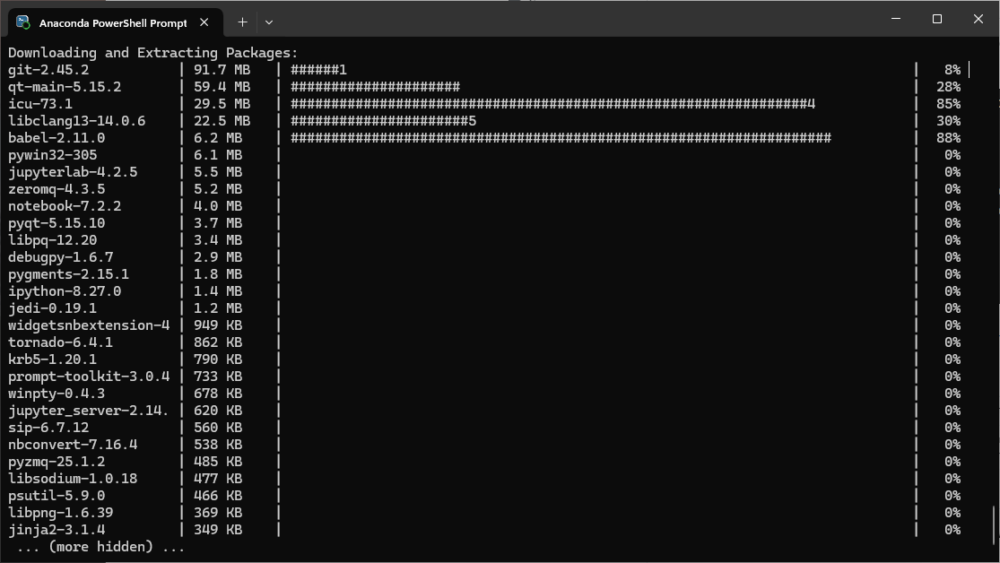
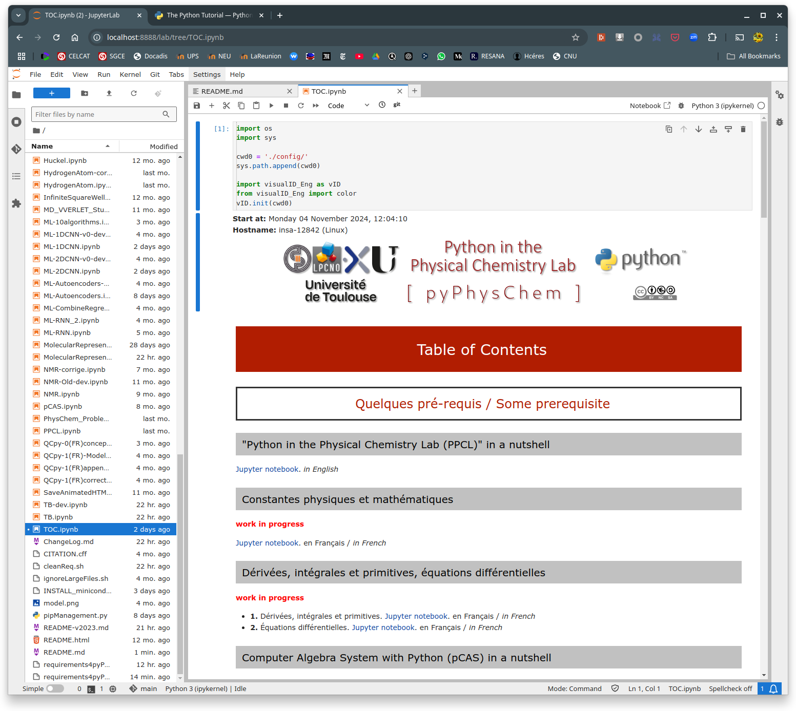

<a name="top">

<p style="text-align:center;"> 
</a>
</p>

**Ce dépôt GitHub propose une collection de notebooks Jupyter conçus pour intégrer la programmation en Python dans l'enseignement de la chimie physique. Ces notebooks fournissent des exemples commentés et illustrés, couvrant des sujets tels que les dérivées et les intégrales, l'atome d'hydrogène et les représentations moléculaires. Ce dépôt inclut également des ressources pour des applications d'apprentissage automatique en chimie, comme les réseaux de neurones artificiels et les autoencodeurs. Pour utiliser ces outils, les utilisateurs sont invités à installer Jupyter ainsi qu'une distribution Python, Anaconda étant recommandée. Des instructions détaillées pour cloner le dépôt et exécuter les notebooks sont disponibles dans ce fichier README.md**

&#x1f1ec;&#x1f1e7; <span style="color:blue; font-style: italic;">**This GitHub repository offers a collection of Jupyter Notebooks designed to integrate Python programming into physical chemistry education. These notebooks provide commented and illustrated examples, covering topics such as derivatives and integrals, the hydrogen atom, and molecular representations. The repository also includes resources for machine learning applications in chemistry, like artificial neural networks and autoencoders. To utilize these materials, users are advised to install Jupyter and a Python distribution, with Anaconda being a recommended option. Detailed instructions for cloning the repository and running the notebooks are provided in the present README.md document**</span>

<u>**Table des Matières**</u>

-   [Document principal et pré-requis](#main)
-   [Installation et activation d'une distribution python](#howto)
    - [Introduction](#intro)
    - [Installation de miniconda](#miniconda)
    - [Activation d'un environnement conda](#activation)
    - [Installation des bibliothèques Python et des outils additionnels nécessaire](#lib)
-   [Clonage du dépôt (repository) pyPhysChem et installation des bibliothèques Python nécessaires](#clone)
-   [Utiliser ces notebooks à l'aide de JupyterLab](#jupyterlab)
-   [Liste des changements](#changes)
-   [Comment citer ce travail ?](#cite)

&#x1f1ec;&#x1f1e7; <u>**Table of Contents**</u>

-   [*Main document and prerequisites*](#main)
-   [*Installation and activation of a Python distribution*](#howto)
    - [*Introduction*](#intro)
    - [*Installing miniconda*](#miniconda)
    - [*Activation of a conda environment*](#activation)
    - [*Installation of the required Python libraries and additional tools*](#lib)
-   [*Cloning of the pyPhysChem repository and installation of the required libraries*](#clone)
-   [&#x1f1ec;&#x1f1e7; *Use these notebooks with JupyterLab*](#jupyterlab)
-   [L*List of changes*](#changes)
-   [*How to cite this work?*](#cite)
    
## Document principal et pré-requis / &#x1f1ec;&#x1f1e7; <span style="color:blue; font-style: italic;">Main document and prerequisites</span>

<a name="main"></a> 

Il faut lire le fichier [TOC.ipynb](./TOC.ipynb), qui renvoie vers des sous-thèmes. Chaque sous-thème est introduit par les objectifs de ces TP, ainsi qu'une table des matières qui permet d'accéder aux cours/TP et aux exercices.

**Pré-requis** : des notions très élémentaires d'algorithmique (variables, tests conditionnels, boucles).
<span style="color:red">&#x1F914; Vous voulez rafraîchir vos connaissances et renforcer vos acquis ?</span>
**Le notebook [PPCL.ipynb](./PPCL.ipynb) est fait pour ça. Il est un peu long, mais il en vaut la peine** &#x1F60A;.
 Vous pouvez peut-être même vous lancer sans aucune connaissance algorithmique de base. C'est à vous de voir si cela vous suffit.&#x1F4AA;&#x1F4AA;&#x1F3FC;&#x1F4AA;&#x1F3FF;

<div style="color:blue; font-style: italic;">
    
&#x1f1ec;&#x1f1e7; Read the [TOC.ipynb](./TOC.ipynb) file, which points to subtopics. Each subtopic is introduced by the goals of the course, as well as a table of contents that allows access to the courses/tutorials and exercises.</span>

&#x1f1ec;&#x1f1e7; **Prerequisite** : very basic notions of algorithmic (variables, conditional tests, loops).
<span style="color:red">&#x1F914; Do you want to refresh your knowledge and reinforce your skills?</span>
**This is what the [PPCL.ipynb](./PPCL.ipynb) notebook is for. It's a bit long, but it's worth the effort** &#x1F60A;. You may even be able to get started without any basic algorithmic knowledge. It's up to you to see if that's enough for you.&#x1F4AA;&#x1F4AA;&#x1F3FC;&#x1F4AA;&#x1F3FF;</div>


## Installation et activation d'une distribution Python / &#x1f1ec;&#x1f1e7; <span>Installation and activation of a Python distribution</span>

<a name="howto"></a> 

### Introduction

Il faut d'abord avoir installé [Jupyter](https://jupyter.org/) ainsi qu'une distribution python sur son PC.

La solution la plus simple est d'installer et utiliser [Anaconda](https://www.anaconda.com/), qui est une distribution libre et open source du langage de programmation Python :

-   Les versions de paquetages sont gérées par le système de gestion de
    paquets conda
-   Elle comprend également Anaconda Navigator, qui est une interface
    graphique "user-friendly"
-   Les applications suivantes sont disponibles par défaut dans le
    navigateur :
    -   JupyterLab & Jupyter Notebook
    -   Spyder
    -   RStudio
    -   ...
-   Anaconda est disponible pour MacOS, Windows, Linux.
-   Il existe une version "light", nommée [miniconda](https://docs.anaconda.com/miniconda/)

**On va ensuite apprendre à installer `miniconda`, ce qui va imposer de lancer des lignes de commandes**

<div style="color:blue; font-style: italic;">

&#x1f1ec;&#x1f1e7; First install [Jupyter](https://jupyter.org/) as well as a Python distribution on your PC.

&#x1f1ec;&#x1f1e7; A simple and easy possibility is to install [Anaconda](https://www.anaconda.com/), a free and opensource
distribution of the Python programming language:

-   Package versions are managed by the package management system
    conda
-   It also includes a user friendly GUI, Anaconda Navigator
-   The following applications are available by default in Navigator:
    -   JupyterLab & Jupyter Notebook
    -   Spyder
    -   RStudio
    -   ...
-   Anaconda runs under MacOS, Windows, Linux
-   There is a lighter version, called [miniconda](https://docs.anaconda.com/miniconda/)

&#x1f1ec;&#x1f1e7; **We're next going to learn how to install `miniconda`, which will require us to run command lines**
</div>

### Installation de `miniconda` / &#x1f1ec;&#x1f1e7; <span style="color:blue; font-style: italic;">Installing `miniconda`</span>

<a name="miniconda"></a> 

- téléchargez le [programme d'installation pour votre OS](https://docs.anaconda.com/miniconda/) (Windows/macOS/linux)

- exécutez-le :
    - **Windows** : allez dans le répertoire Téléchargement, cliquez deux fois sur l'icone `Miniconda3-latest-Linux-x86_64.exe`
    - **Linux** : ouvez un terminal, `cd` vers le répertoire Téléchargement, tapez `bash Miniconda3-latest-Linux-x86_64.sh`

- pendant l'installation :
    - validez l'accord de licence
    - choisissez le répertoire d'installation - ou sinon validez la proposition de répertoire par défaut
        - **Windows**: `C:\Users\<premières-lettres-de-votre-username>\miniconda3`
        - **Linux** : `/home/<votre-username>/miniconda3`)
    - finalisez l'installation :
        - **Windows** : selectionnez les Options Avancées de Configuration. Ne cochez pas "*Ajoutez Miniconda3 à la variable d'environnement PATH*" si vous craignez un conflit avec une autre distribution Python que vous pourriez avoir dans votre compte local

        <div style="text-align:center"></div>

        - **Linux**: vous devez répondre à une question concernant la variable d'environnement PYTHONPATH. Répondez "non" si vous craignez un conflit avec une autre distribution Python que vous pourriez avoir dans votre compte local
        
        <div style="text-align:center"></div>

<div style="color:blue; font-style: italic;">

- &#x1f1ec;&#x1f1e7; download the [installer for your OS](https://docs.anaconda.com/miniconda/) (Windows/macOS/linux)

- &#x1f1ec;&#x1f1e7; execute it:
    - **Windows**: go to the download directory, double click on the `Miniconda3-latest-Linux-x86_64.exe` icon
    - **Linux**: open a terminal, `cd` to the download directory, type `bash Miniconda3-latest-Linux-x86_64.sh` 

- &#x1f1ec;&#x1f1e7; during the installation process:
    - validate the license agreement
    - choose the installation folder - or accept the folder defined by default:
        - **Windows**: `C:\Users\<first-letters-of-your-username>\miniconda3`
        - **Linux** : `/home/<your-username>/miniconda3`)
    - finalize the installation
        - **Windows**: select the Advanced Configuration Options. Do not select the "*Add Miniconda3 to my PATH environment variable*" checkbox if you fear a conflict with another python distribution that would you have in your local account.

        <div style="text-align:center"></div>

        - **Linux**: you need to answer a question about the PYTHONPATH environment variable. Answer no if you fear a conflict with another python distribution that would you have in your local account.
        
        <div style="text-align:center"></div>

&#x1f1ec;&#x1f1e7; **Whatever the OS of your computer is, you end up with a "base" python distribution, provided and manageable with conda. Given the PATH environment selection chosen during the installation, you might have to activate the python environment**
</div>

### Activation d'un environnement conda / &#x1f1ec;&#x1f1e7; <span style="color:blue; font-style: italic;">activation of a conda environment</span>

<a name="activation"></a> 

#### Windows

- cherchez l'application **Anaconda Powershell Prompt** dans le champ de recherche:
<br>&#x1f1ec;&#x1f1e7; <span style="color:blue; font-style: italic;">search for the **Anaconda Powershell Prompt** application in the search field:</span>
- exécutez-là. Vous devriez voir apparaître un terminal, avec une invite de commande (prompt) `(base) PS C:\Users\<first-letters-of-your-username>>`
<br>&#x1f1ec;&#x1f1e7; <span style="color:blue; font-style: italic;">execute it. You should see a terminal, with a `(base) PS C:\Users\<first-letters-of-your-username>>` prompt:</span>
    <div style="text-align:center"></div>

#### Linux

- ouvez un terminal
<br>&#x1f1ec;&#x1f1e7; <span style="color:blue; font-style: italic;">open a terminal</span>

- tapez la commande:
<br>&#x1f1ec;&#x1f1e7; <span style="color:blue; font-style: italic;">type the command:</span>

    ```bash
    eval "$(/home/<your-username>/miniconda3/bin/conda shell.bash hook)"
    ```

    L'invite de commande (prompt) devrait débuter avec `(base)`:
    <br>&#x1f1ec;&#x1f1e7; <span style="color:blue; font-style: italic;">The prompt should now start with `(base)`:</span>
     <div style="text-align:center"></div>

- pour désactiver l'environnement de "base" de conda, tapez:
<br>&#x1f1ec;&#x1f1e7; <span style="color:blue; font-style: italic;">to deactivate the "base" python environment of conda, type:</span>

    ```bash
    conda deactivate
    ```
### Installation des bibliothèques Python et des outils additionnels nécessaires / &#x1f1ec;&#x1f1e7; <span style="color:blue; font-style: italic;">Installation of the required Python libraries and additional tools</span>

<a name="lib"></a>

#### Introduction

Vous devez installer dans votre environnement Python des bibliothèques additionnelles ainsi qu'un outil, nommé `git`. `git` est utilisé pour gérer et suivre les modifications du code ou des fichiers d'un projet, permettant le contrôle de version, la collaboration et une gestion efficace des projets en développement logiciel. Une option très utile est fournie par la commande `git clone`, qui permet de créer une copie locale d'un dépôt Git distant, comme celui hébergé sur GitHub. Cette commande télécharge l'intégralité du projet, y compris son historique, ses branches et ses fichiers, vous permettant de travailler localement sur le code. Il faut aussi installer les outils Jupyter, qui ne font pas partie de la distribution miniconda.

<div style="color:blue; font-style: italic;">
    
&#x1f1ec;&#x1f1e7; You must install additional libraries in your Python environment, as well as a tool named `git`. `git` is used to manage and track changes in code or project files, enabling version control, collaboration, and efficient project management in software development. A very useful option is provided by the `git clone` command, used to create a local copy of a remote Git repository, such as one hosted on GitHub. This command downloads the entire project, including its history, branches, and files, allowing you to work on the code locally. You also need to install the Jupyter tools, which are not included in the miniconda distribution.

</div>

#### Installation de `git` et des outils Jupyter / &#x1f1ec;&#x1f1e7; <span style="color:blue; font-style: italic;">Installation of `git` and of the Jupyter tools</span>

- Sous **Windows**, ouvrez l'application Anaconda PowerShell Prompt.
<br>&#x1f1ec;&#x1f1e7; <span style="color:blue; font-style: italic;">On **Windows**, open an Anaconda PowerShell Prompt</span>
- Sous **Linux**, ouvez un terminal et activez conda:
<br>&#x1f1ec;&#x1f1e7; <span style="color:blue; font-style: italic;">On **Linux**, open a terminal and activate conda:</span>


    ```bash
    eval "$(/home/<your-username>/miniconda3/bin/conda shell.bash hook)"
    ```

- tapez la commande ci-dessous:
<br>&#x1f1ec;&#x1f1e7; <span style="color:blue; font-style: italic;">type the command below:</span>

    ```bash
    conda install git jupyter
    ```

    <br>L'affichage devrait être simlaire à la capture d'écran ci-dessous:
    <br>&#x1f1ec;&#x1f1e7; <span style="color:blue; font-style: italic;">You should see something similar to:</span>
    <div style="text-align:center"></div>

</div>

#### Installation de bibliothèques Python additionnelles / &#x1f1ec;&#x1f1e7; <span style="color:blue; font-style: italic;">Installation of additional Python libraries</span>

Cela doit être fait avec des lignes de commande, à l'aide Anaconda PowerShell Prompt (**Windows**) ou dans un terminal où conda a été activé (**Linux**). Vous pouvez utiliser :

```bash
conda install <name-of-the-python-library>
```

ou

```bash
pip install <name-of-the-python-library>
```

`conda install` est un gestionnaire de paquets qui gère des dépendances complexes et des bibliothèques non-Python. Cela le rend idéal pour les environnements scientifiques et de data science. Il dispose d'une résolution de dépendances robuste et est utilisé pour créer des environnements indépendants avec des versions spécifiques de paquets et de Python lui-même. En revanche, `pip install` est spécifique aux paquets Python provenant de PyPI. Il est plus rapide pour les installations simples, mais ne gère pas aussi bien les dépendances non-Python. Utilisez `conda` pour des configurations complexes avec des bibliothèques externes, et `pip` pour des projets Python plus simples.

En résumé, `conda` est précieux pour les projets de data science nécessitant des dépendances complexes ou une compatibilité entre plusieurs langages de programmation, tandis que `pip` reste un excellent choix pour des flux de travail plus simples basés uniquement sur Python.

**Dans la section suivante, il sera recommandé d'installer les bibliothèques Python utilisées par pyPhysChem avec `pip`**

<div style="color:blue; font-style: italic;">

&#x1f1ec;&#x1f1e7; It must be done with lines of command, in an Anaconda PowerShell Prompt (**Windows**) or in a terminal where conda has been activated (**Linux**). You can either use:

```bash
conda install <name-of-the-python-library>
```

or

```bash
pip install <name-of-the-python-library>
```

<br>

&#x1f1ec;&#x1f1e7; `conda install` is a package manager that handles complex dependencies and non-Python libraries. That makes it ideal for scientific and data science environments. It has robust dependency resolution and is used to create isolated environments with specific versions of packages and Python itself. In contrast, `pip install` is specific to Python packages from PyPI. It is faster for simple installations, but doesn’t handle non-Python dependencies as well. Use `conda` for complex setups with external libraries, and `pip` for straightforward Python projects.

&#x1f1ec;&#x1f1e7; In short, `conda` is valuable for data science projects that require complex dependencies or cross-language compatibility, while `pip` remains a great choice for more straightforward Python-based workflows.

&#x1f1ec;&#x1f1e7; **In the next section, it will be recommended to install the Python libraries used by pyPhysChem with `pip`**

</div>

[&#x1F51D; top &#x1F51D;](#top)

## Clonage du dépôt (repository) pyPhysChem et installation des bibliothèques Python nécessaires / &#x1f1ec;&#x1f1e7; <span style="color:blue; font-style: italic;">Cloning of the pyPhysChem repository and installation of the required libraries</span>

<a name="clone"></a> 

### Clonage / &#x1f1ec;&#x1f1e7; <span style="color:blue; font-style: italic;">Cloning</span>

**C'est la méthode recommandée**, car elle facilite la mise à jour des notebooks. Vous devez saisir des lignes de commandes depuis l'application Anaconda PowerShell Prompt (**Windows**) ou bien depuis un terminal où conda a été activé (**Linux**)
<br>&#x1f1ec;&#x1f1e7; <span style="color:blue; font-style: italic;">**This is the recommended way**, given the ease of updating notebooks. You need to enter command lines from the Anaconda PowerShell Prompt application (**Windows**) or from a terminal where conda has been activated (**Linux**).</span>

Depuis le répertoire où vous voulez installer les notebooks, tapez la commande :
<br>&#x1f1ec;&#x1f1e7; <span style="color:blue; font-style: italic;">Go into the folder in which the notebooks will be installed, and type:</span>

```bash
git clone https://github.com/rpoteau/pyPhysChem.git
```

Vous avez maintenant un répertoire `pyPhysChem` dans le répertoire depuis
lequel vous avez lancé la commande `git`
<br>&#x1f1ec;&#x1f1e7; <span style="color:blue; font-style: italic;">You now have a `pyPhysChem`
folder installed in the folder from which the `git` command was ran</span>

### Mise à jour / &#x1f1ec;&#x1f1e7; <span style="color:blue; font-style: italic;">Update</span>

<a name="update"></a> 

pyPhysChem étant un projet en évolution, il faut régulièrement vérifier qu'il n'y a pas de mise à jour. La commande suivante met si nécessaire à jour le contenu du répertoire `pyPhysChem`
<br>&#x1f1ec;&#x1f1e7; <span style="color:blue; font-style: italic;">pyPhysChem being a work-in-progress project, it is necessary to regularly check for a possible update. The content of the `pyPhysChem` folder is updated by using the following process</span>:

- allez d'abord dans le répertoire pyPhysChem
    <br><span style="color:blue; font-style: italic;">first go into the `pyPhysChem` folder</span>
- puis tapez
    <br><span style="color:blue; font-style: italic;">and then enter:</span>

    ```bash
    git pull origin main
    ```

### Installation des bibliothèques requises / &#x1f1ec;&#x1f1e7; <span style="color:blue; font-style: italic;">Installation of the necessary libraries

Comme pour les autres installations, toutes les commandes s'exécutent à partir d'un terminal **Linux** avec l'environnement de base activé, ou bien depuis l'application Anaconda PowerShell Prompt sous **Windows**

&#x1f1ec;&#x1f1e7; <span style="color:blue; font-style: italic;">As with other installations, all commands are run from a **Linux** terminal with the base environment activated, or from the Anaconda PowerShell Prompt application on **Windows**</span>

- allez d'abord dans le répertoire pyPhysChem
    <br>&#x1f1ec;&#x1f1e7; <span style="color:blue; font-style: italic;">first go into the `pyPhysChem` folder</span>
- il y a un fichier nommé `requirements4pyPhysChem-LastVersion.txt`, qui contient la liste de toutes les bibliothèques nécessaires pour exécuter tous les codes Python des notebooks Jupyter de pyPhysChem
    <br>Exécutez la commande ci-dessous, puis soyez patient(e)s
    <br>&#x1f1ec;&#x1f1e7; <span style="color:blue; font-style: italic;">There is a file named `requirements4pyPhysChem-LastVersion.txt`, which contains the list of all the libraries required to run all the Python codes from the Jupyter notebooks of pyPhysChem
  <br>Run the command below, then be patient:

  ```bash
  pip install -r requirements4pyPhysChem-LastVersion.txt
  ```

    </span>
- **Dépannage**: si une erreur d'installation se produit car une bibliothèque est indisponible pour votre OS, éditez le fichier `requirements4pyPhysChem-LastVersion.txt`, effacez la ligne correspondante, et relancez la commande d'installation
    <br>&#x1f1ec;&#x1f1e7;<span style="color:blue; font-style: italic;">**Troubleshooting**: If an installation error occurs because a library is unavailable for your OS, edit the `requirements4pyPhysChem-LastVersion.txt` file, delete the corresponding line, and rerun the installation command</span>
- il ne vous reste plus qu'à vérifier qu'il n'y a pas de problèmes. La commande `pip check` doit renvoyer `No broken requirements found`
    <br>&#x1f1ec;&#x1f1e7;<span style="color:blue; font-style: italic;">All that’s left is to check that there are no issues. The command `pip check` should return `No broken requirements found`</span>

[&#x1F51D; top &#x1F51D;](#top)

## Utiliser ces notebooks à l'aide de JupyterLab / &#x1f1ec;&#x1f1e7; <span style="color:blue; font-style: italic;">Use these notebooks with JupyterLab</span>

<a name="jupyterlab"></a> 

-   Ouvrez un terminal (**Linux** - et n'oubliez pas d'activer conda avec `eval "$(/home/<your-username>/miniconda3/bin/conda shell.bash hook)"`) ou bien l'application Anaconda PowerShell Prompt (**Windows**)
    <br>&#x1f1ec;&#x1f1e7;<span style="color:blue; font-style: italic;">Open a terminal (**Linux** - and don't forget to activate conda with `eval "$(/home/<your-username>/miniconda3/bin/conda shell.bash hook)"`) or the Anaconda PowerShell Prompt application (**Windows**)</span>
-   Allez dans le répertoire qui contient pyPhysChem (commande `cd <chemin_d_accès>`)
    <br>&#x1f1ec;&#x1f1e7;<span style="color:blue; font-style: italic;">Navigate to the folder that contains pyPhysChem (`cd <pathway>` command)</span>
-   tapez la commande :
    <br>&#x1f1ec;&#x1f1e7; <span style="color:blue; font-style: italic;">enter the command:</span>
    
    ```bash
    jupyter-lab TOC.ipynb
    ```

- jupyter-lab devrait s'ouvrir dans votre navigateur:
    <br>&#x1f1ec;&#x1f1e7; <span style="color:blue; font-style: italic;">Jupyter-lab should open in your browser:</span>

     <div style="text-align:center"></div>

[&#x1F51D; top &#x1F51D;](#top)

## Liste des changements / &#x1f1ec;&#x1f1e7; <span style="color:blue; font-style: italic;">List of changes</span>

<a name="changes"></a>

[🔄 Liste des changements / <span style="color:blue; font-style: italic;">List of changes</span> 🔄](./ChangeLog.md)

## Comment citer ce travail ? / &#x1f1ec;&#x1f1e7; <span style="color:blue; font-style: italic;">How to cite this work?</span>

<a name="cite"></a> 

Si vous utilisez des parties significatives des codes publiés dans ce dépôt github, ou bien s'il a été utile pour votre auto-formation, veuillez le citer comme suit :<br>

&#x1f1ec;&#x1f1e7; <span style="color:blue; font-style: italic;">If you use pieces of code of this github repository that turned out to be decisive to your work, or that have been useful for your self-learning, please cite it as follows:</span>

N. Bernard, M. Charnay, S. Christodoulou, I. C. Gerber, F. Jolibois and R. Poteau*, *Python in the Physical Chemistry lab (pyPhysChem) github repository*, release v. 2.1.0 (2025), doi: [10.5281/zenodo.14050542](https://doi.org/10.5281/zenodo.14050542)
    
[](https://doi.org/10.5281/zenodo.14050542)

[&#x1F51D; top &#x1F51D;](#top)
